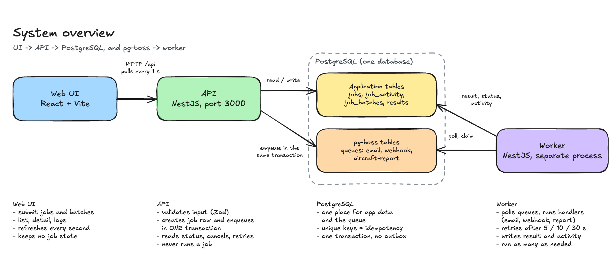
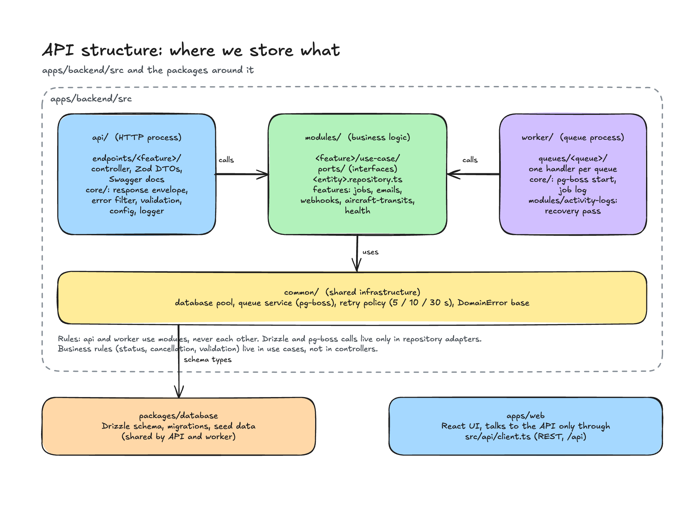
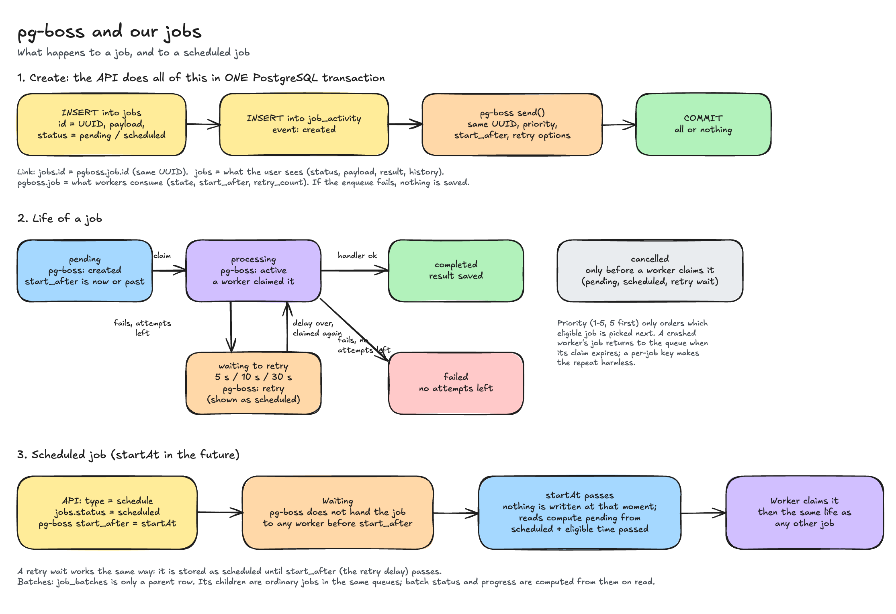
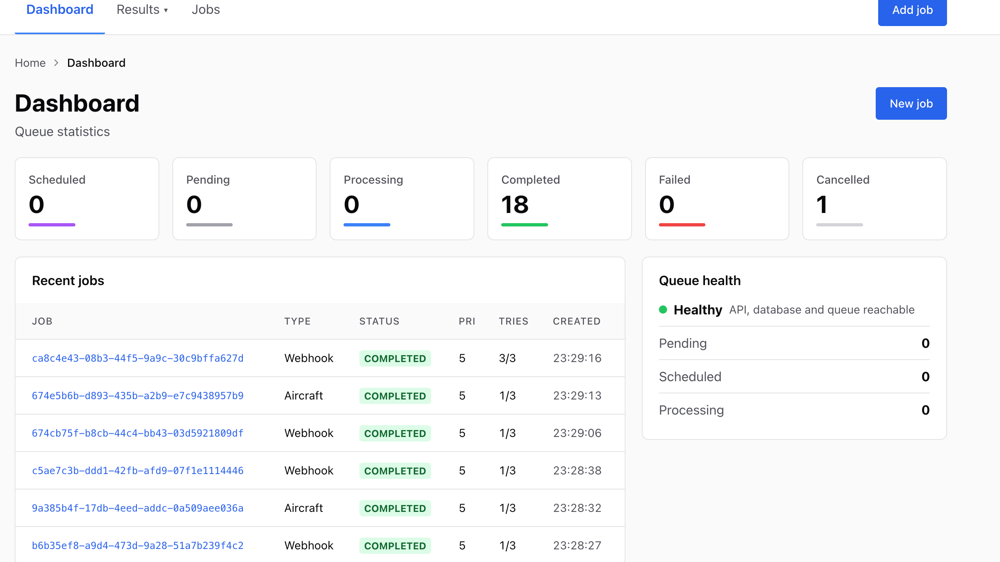
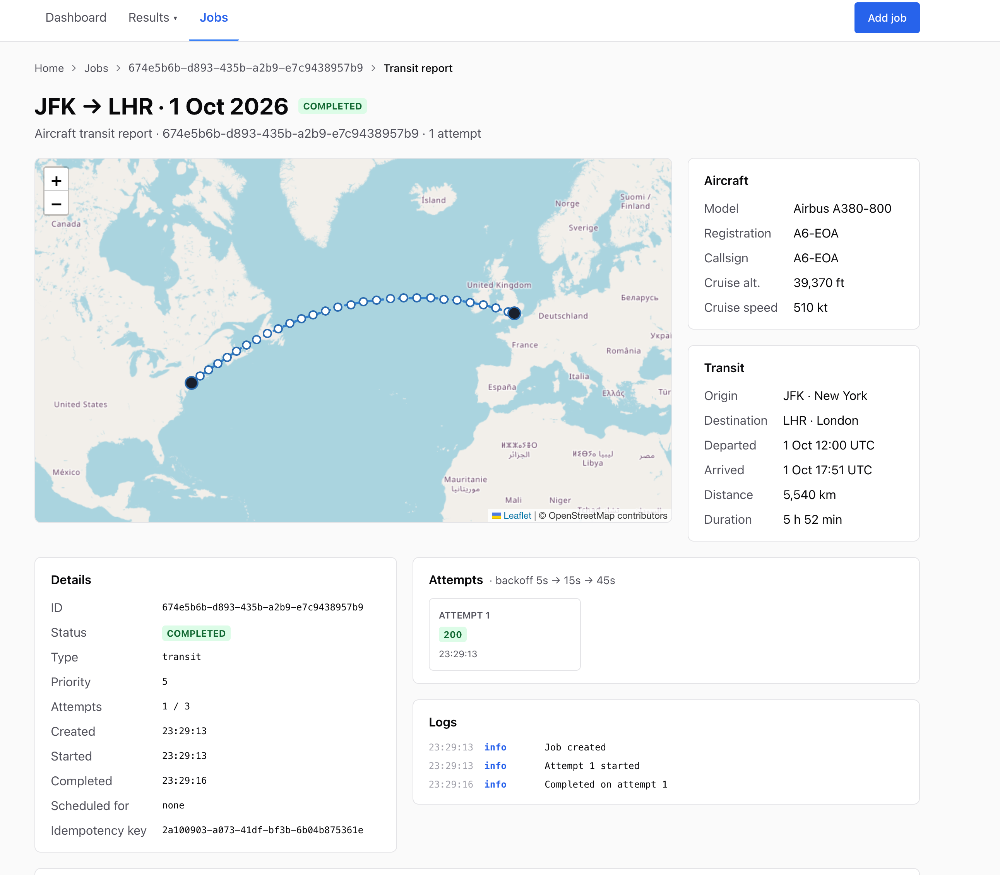
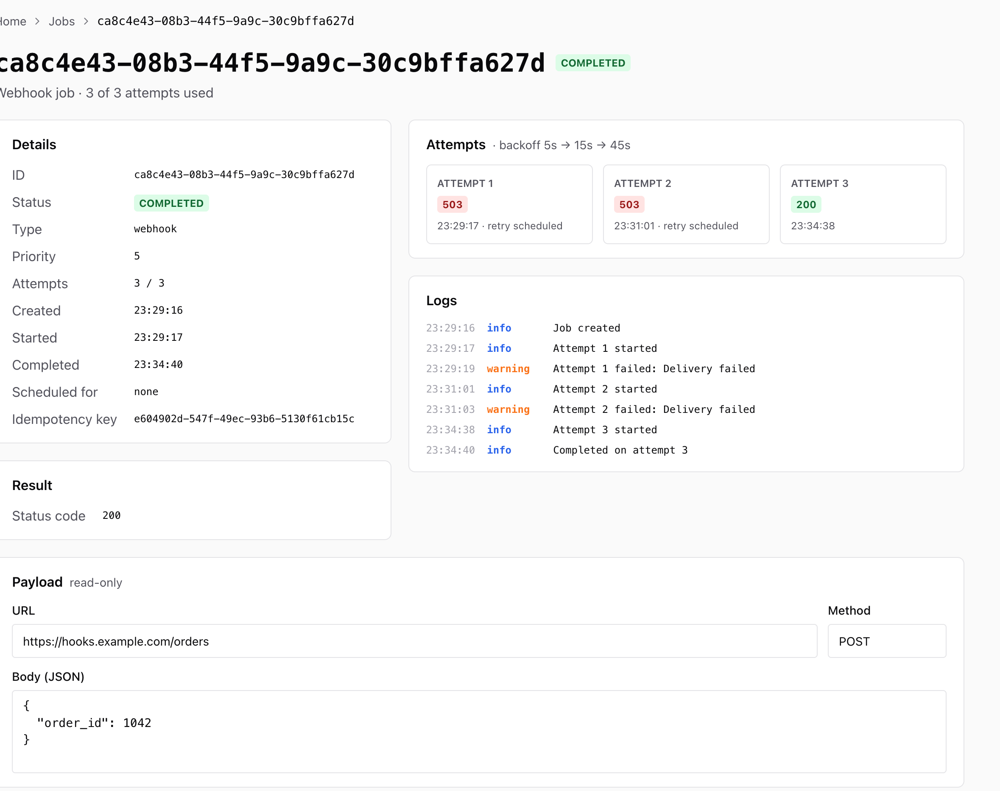

# nest-strict-starter

NestJS backend and Drizzle database package in a pnpm + Turbo monorepo.

## Start the project

## Links

- Swagger UI at [http://localhost:3000/api/docs](http://localhost:3000/api/docs)
- Web UI at [http://localhost:5173]('http://localhost:5173')

### Docker Compose

```bash
cp .env.example .env
docker compose up -d
```

Run `docker compose down` to stop the containers; the database volume remains. The migration and seed service is safe to run again when Compose recreates it. If port 5433 is occupied, set another `POSTGRES_PORT` in `.env` before starting Compose.

### Local development

```bash
pnpm install
pnpm run setup
pnpm run dev
```

## Diagrams

Excalidraw diagrams in [`docs/`](./docs). Open them at [excalidraw.com](https://excalidraw.com) (drag the file in) or with the Excalidraw VS Code extension.

<p align="center">
<a href="./docs/system-overview.png"></a>
<p/>

<p align="center">
<a href="./docs/api-structure.png"></a>
<p/>

<p align="center">
<a href="./docs/pg-boss-jobs.png"></a>
<p/>

## Screenshots

<p align="center">

<p/>

<p align="center">

<p/>

<p align="center">

<p/>

## Run tests

Run these commands from the repository root.

### Unit tests

```bash
pnpm test                         # all packages
pnpm --filter backend test        # backend only
pnpm --filter web test            # web only
pnpm --filter backend test:watch  # rerun backend tests while editing
```

### E2E and database integration tests

1. Run `pnpm run setup` to start PostgreSQL, apply the Drizzle and queue migrations, and seed airport and aircraft data.
2. Stop `pnpm dev` or any other worker using this database, then run:

```bash
set -a && . ./.env && set +a && pnpm --filter backend test:integration
```

The integration command runs the backend's `*.e2e-spec.ts` files against the database named in the root `.env`. It runs separately from `pnpm test`; keep other workers stopped so they do not consume jobs created by the suite.

## Submit an email job

```bash
curl -X POST http://localhost:3000/api/jobs/email \
  -H 'Content-Type: application/json' \
  -d '{"idempotencyKey":"e523db7b-c6aa-4c9e-bd57-4885dc3ee319","type":"instant","priority":3,"payload":{"recipient":"person@example.com","subject":"Welcome","body":"Hello"}}'
```

The response includes a job ID. Use `GET /api/jobs/:id` for its status and activity; after delivery, its `result.emailId` identifies the sent email. To delay delivery, set `type` to `schedule` and add a future ISO 8601 `startAt`; `DELETE /api/jobs/:id` cancels a pending or scheduled job. Generate a new UUID `idempotencyKey` for each submission; repeating one returns HTTP 409. The worker process logs job pickup and attempt outcomes by job ID.

## Submit a webhook or aircraft report job

Both use the same envelope as the email job (`idempotencyKey`, `type`, `priority`, optional `startAt`) with a different `payload`:

```bash
curl -X POST http://localhost:3000/api/jobs/webhook \
  -H 'Content-Type: application/json' \
  -d '{"idempotencyKey":"0b7d4f52-3c1a-4e63-9d57-1f3a8f0c2b11","type":"instant","priority":3,"payload":{"url":"https://example.com/hook","payload":{"hello":"world"}}}'

curl -X POST http://localhost:3000/api/jobs/aircraft-report \
  -H 'Content-Type: application/json' \
  -d '{"idempotencyKey":"5a1c9e07-8d42-4b6f-a3e1-7c2d9b4f6a80","type":"instant","priority":3,"payload":{"originIcao":"RJTT","destinationIcao":"KSFO","aircraftId":"<id from GET /api/aircraft>","departureAt":"2030-01-01T10:00:00Z"}}'
```

`GET /api/jobs/:id` returns the status, activity, and a `result` of `{ webhookCallId }` or `{ reportId }` once the job completes; `DELETE /api/jobs/:id` cancels a pending or scheduled job. A repeated `idempotencyKey` returns HTTP 409 on every route, and an invalid transit request (unknown airport or aircraft, same airport, past departure) returns HTTP 400. Retried jobs are safe: a webhook is delivered with a per-job key and one report is stored per job. Reset a development database with `docker compose down -v && pnpm run setup`.

## Manage jobs

| Endpoint                                | Purpose                                                                                                                                                                                                                                                                                               |
| --------------------------------------- | ----------------------------------------------------------------------------------------------------------------------------------------------------------------------------------------------------------------------------------------------------------------------------------------------------- |
| `GET /api/jobs`                         | Paged list, newest first. Query: `queue`, `status` (comma-separated), `search` (job ID or payload text, case-insensitive), `page` (default 1), `pageSize` (1-100, default 10). Returns `{ items, page, pageSize, total, totalPages }`; a scheduled job whose start has passed is listed as `pending`. |
| `GET /api/jobs/stats`                   | `{ counts, healthy }`: a count for each of the six statuses, and whether the database and queue answer.                                                                                                                                                                                               |
| `GET /api/health`                       | `{ status: 'ok' \| 'down', checks: { database, queue }, counts }`: each check is `up` or `down` (2 second timeout), `counts` has the six job statuses (zeros while the database is down). HTTP 200 when ok; HTTP 503 when down, with the same report in `error.details`.                              |
| `GET /api/jobs/:id`                     | One job with its `payload`, `maxAttempts`, `attempts`, `lastErrorCategory`, `completedAt`, and ordered `activity`.                                                                                                                                                                                    |
| `POST /api/jobs/:id/retry`              | Grants a failed job one more attempt (HTTP 404 unknown, 409 if not failed).                                                                                                                                                                                                                           |
| `DELETE /api/jobs/:id`                  | Cancels a pending or scheduled job.                                                                                                                                                                                                                                                                   |
| `GET /api/aircraft-transit-reports/:id` | The generated report (`reportId` in an aircraft report job's `result`) with its waypoints.                                                                                                                                                                                                            |

Every submission accepts an optional `maxAttempts` (1-10, default 4); a failed attempt is retried after 5 s, then 10 s, then 30 s for every later attempt; a webhook `payload` accepts an optional `method` (`POST` or `PUT`, default `POST`, stored but not sent by the mock). A repeated `idempotencyKey` returns HTTP 409 with `error.details.existingJobId`. Mock webhook delivery fails randomly on one in three attempts, regardless of URL. To demo email retries, use a recipient ending in `@bounce.test`: the mock email client always fails those.

## Job batches

A batch creates 1-100 child jobs (email, webhook, or aircraft report) that share one schedule, priority, and attempt limit. Children are ordinary jobs on the existing queues and run on the existing workers; there is no parent queue job.

```bash
curl -X POST http://localhost:3000/api/job-batches \
  -H 'Content-Type: application/json' \
  -d '{"idempotencyKey":"8f14e45f-ceea-4e67-a1b4-0c1d2e3f4a5b","type":"instant","priority":3,"maxAttempts":4,"items":[{"type":"email","payload":{"recipient":"person@example.com","subject":"Hi","body":"Hello"}},{"type":"webhook","payload":{"url":"https://example.com/hook","payload":{"hello":"world"}}}]}'
```

| Endpoint                            | Purpose                                                                                                                                                                                                                                                                                                                                          |
| ----------------------------------- | ------------------------------------------------------------------------------------------------------------------------------------------------------------------------------------------------------------------------------------------------------------------------------------------------------------------------------------------------ |
| `POST /api/job-batches`             | HTTP 202 with the batch `id` and `startAt`. Body: `{ idempotencyKey, type, startAt?, priority, maxAttempts, items: [{ type, payload }] }`. A repeated batch key returns 409 with `details.existingBatchId`; an invalid child returns 400 with `details.position` (1-based). Creation is atomic: no child exists unless every child was enqueued. |
| `GET /api/job-batches`              | Paged list (`page`, `pageSize` 1-100), newest first, with derived status, counts, and progress.                                                                                                                                                                                                                                                  |
| `GET /api/job-batches/:id`          | The batch and its children in submission order (ID, position, queue, status, result, link to `GET /api/jobs/:id`).                                                                                                                                                                                                                               |
| `GET /api/job-batches/:id/activity` | One time-ordered feed (oldest first): a batch-created entry, every task's activity events tagged with `jobId`, `queue`, and 1-based `position`, and a cancellation-requested entry when one was made. Unpaged (at most 100 tasks); 404 unknown.                                                                                                  |
| `DELETE /api/job-batches/:id`       | Records the cancellation request and cancels every unclaimed child; a running child finishes or fails but is not retried. Repeating it returns the batch unchanged; 404 unknown, 409 when every child finished and the batch was never cancelled.                                                                                                |

Batch status is derived from its children when read and is not the same as a child job status: `scheduled`, `pending`, `processing`, `completed`, `completed_with_errors` (a child failed or was cancelled on its own), `cancelling` (cancellation requested, a child still running), and `cancelled`. `progress` is `round(100 * (completed + failed + cancelled) / total)`; a processing child does not count. `GET /api/jobs` lists standalone jobs only: batch children are left out (read them through the batch or by ID), and the single-job cancel and retry endpoints return 409 for a child. `GET /api/jobs/stats` and `GET /api/health` still count every execution job, children included, never the batch parents.

## Current backend layout

| Path                        | Responsibility                                                                      |
| --------------------------- | ----------------------------------------------------------------------------------- |
| `apps/backend/src/api/`     | HTTP bootstrap, controllers, Zod DTOs, validation, response mapping, and API wiring |
| `apps/backend/src/modules/` | Business use cases and feature-owned errors, ports, and adapters                    |
| `apps/backend/src/common/`  | Infrastructure shared by HTTP and the worker                                        |
| `apps/backend/src/worker/`  | Queue consumer application and job handler registration                             |
| `packages/database/`        | Drizzle schema, client types, and migrations                                        |
